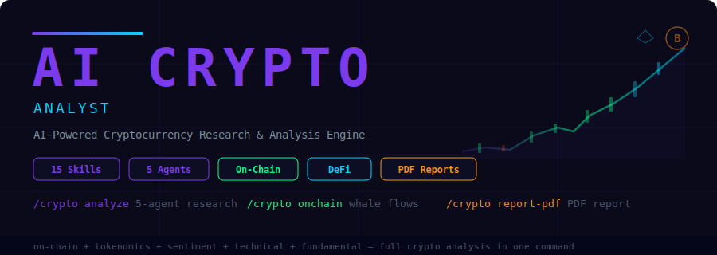

<p align="center">
  
</p>

<p align="center">
  <strong>AI Crypto Analyst for Claude Code.</strong> Run full token analyses with 5 parallel agents, evaluate on-chain data,<br/>
  tokenomics, DeFi protocols, sentiment, narratives, and produce professional PDF research reports — 15 skills, 5 agents, one command.
</p>

<p align="center">
  <a href="https://opensource.org/licenses/MIT"></a>
  
  
  
  
  
  
</p>

---

> **WARNING: This tool is for educational and research purposes only. It is NOT financial advice. It does NOT execute trades, manage funds, or connect to any exchange or wallet. Cryptocurrency is highly volatile and speculative. You could lose your entire investment. Always DYOR (Do Your Own Research) and consult a licensed financial advisor before making any investment decisions.**

---

## Quick Start

```bash
curl -fsSL https://raw.githubusercontent.com/zubair-trabzada/ai-crypto-claude/main/install.sh | bash
```

That's it. One command installs all 15 skills, 5 agents, and the PDF generation scripts.

---

## What Is This?

AI Crypto Analyst is a **research and analysis tool** built as Claude Code skills. It is **not** a trading bot. It does **not** connect to exchanges. It does **not** execute trades or manage funds.

What it does: takes a token symbol and runs a comprehensive multi-dimensional analysis using 5 parallel AI agents — on-chain, tokenomics, sentiment, technical, and fundamental — then produces a composite Crypto Score (0-100) with a clear signal (Strong Buy / Buy / Hold / Neutral / Caution / Avoid).

Run `/crypto analyze BTC` and 5 AI agents launch in parallel to produce a complete crypto research report.

No API keys. No exchange accounts. No wallet connections. Just Claude Code.

---

## What Makes This Different From Stock Analysis?

Crypto is fundamentally different from stocks. This tool was purpose-built for the crypto ecosystem:

| Crypto-Native Feature | Why It Matters |
|----------------------|----------------|
| **On-Chain Analytics** | Whale movements, exchange flows, active addresses, NVT ratio — data that doesn't exist in stocks |
| **Tokenomics Analysis** | Supply schedules, unlock cliffs, inflation rates, staking yields, FDV vs market cap |
| **DeFi Protocol Analysis** | TVL, protocol revenue, yield farming APRs, liquidity depth, smart contract risk |
| **Narrative/Sector Tracking** | AI, DePIN, RWA, L2, meme coin — crypto moves on narratives, not just fundamentals |
| **Token Category Detection** | Automatically adjusts analysis for L1, L2, DeFi, AI/DePIN, meme, RWA, stablecoins |
| **Crypto-Specific Risk** | Smart contract risk, rug pull indicators, regulatory exposure, liquidity depth |

---

## Architecture

```
                         /crypto analyze <token>
                                 |
                   ┌─────────────┼─────────────┐
                   |             |             |
             ┌─────┴──────┐ ┌───┴─────┐ ┌─────┴──────┐
             | crypto-     | | crypto- | | crypto-    |
             | onchain     | | token-  | | sentiment  |
             | agent       | | omics   | | agent      |
             | (whales,    | | agent   | | (CT, news, |
             |  flows,     | | (supply,| |  Fear &    |
             |  addresses) | |  FDV,   | |  Greed,    |
             |             | |  unlock)| |  Reddit)   |
             └─────────────┘ └────────┘ └────────────┘
                   |             |             |
             ┌─────┴──────┐ ┌───┴─────┐
             | crypto-     | | crypto- |
             | technical   | | funda-  |
             | agent       | | mental  |
             | (price,     | | agent   |
             |  indicators,| | (team,  |
             |  patterns)  | |  moat,  |
             |             | |  adopt) |
             └─────────────┘ └────────┘
                   |             |             |
                   └─────────────┼─────────────┘
                                 |
                   ┌─────────────┴─────────────┐
                   |   Composite Crypto Score   |
                   |   (0-100) + Grade + Signal |
                   |   + PDF Research Report    |
                   └───────────────────────────┘
```

---

## All 15 Commands

### Analysis & Research

| Command | What It Does |
|---------|-------------|
| `/crypto analyze <token>` | **Flagship** — Full crypto analysis with 5 parallel agents. Returns Crypto Score (0-100), on-chain metrics, tokenomics, sentiment, technical levels, fundamentals, and investment thesis. |
| `/crypto quick <token>` | 60-second token snapshot — price, trend, key metrics, signal. No subagents. |
| `/crypto onchain <token>` | On-chain analytics — whale movements, exchange flows, active addresses, network growth, NVT. |
| `/crypto tokenomics <token>` | Tokenomics deep dive — supply schedule, unlocks, inflation, staking yield, FDV analysis. |
| `/crypto sentiment <token>` | Sentiment analysis — Crypto Twitter, Reddit, Fear & Greed Index, news tone, community health. |
| `/crypto defi <protocol>` | DeFi protocol analysis — TVL, protocol revenue, yields, liquidity depth, smart contract risk. |
| `/crypto technical <token>` | Technical analysis — price action, indicators, chart patterns, support/resistance levels. |
| `/crypto fundamental <token>` | Fundamental analysis — project thesis, team, partnerships, adoption, competitive landscape. |

### Narrative & Comparison

| Command | What It Does |
|---------|-------------|
| `/crypto compare <t1> <t2>` | Head-to-head token comparison across all dimensions with a winner recommendation. |
| `/crypto narrative <theme>` | Narrative/sector analysis — AI, DePIN, RWA, L2, memes. Top tokens, momentum, capital flows. |

### Portfolio & Risk

| Command | What It Does |
|---------|-------------|
| `/crypto risk <token>` | Risk assessment — position sizing, volatility, smart contract risk, scenario analysis. |
| `/crypto screen <criteria>` | Token screener — filter by strategy (momentum, value, yield, narrative, etc.). |
| `/crypto watchlist` | Build and update a scored watchlist with ranked opportunities. |

### Reporting

| Command | What It Does |
|---------|-------------|
| `/crypto report-pdf` | Professional 6-page PDF crypto research report with score gauges, charts, and thesis. |

---

## Scoring Methodology

The **Crypto Score** (0-100) is a weighted composite of 5 dimensions:

| Category | Weight | What It Measures |
|----------|--------|------------------|
| On-Chain Health | 20% | Network activity, whale behavior, exchange flows, address growth |
| Tokenomics Quality | 20% | Supply mechanics, unlock risk, inflation, staking economics |
| Sentiment & Momentum | 20% | Social buzz, news tone, community engagement, Fear & Greed |
| Technical Setup | 20% | Trend, momentum, volume, pattern quality, key levels |
| Fundamental Strength | 20% | Project viability, team, adoption, competitive moat, revenue |

### Grade & Signal Interpretation

| Score | Grade | Signal | Meaning |
|-------|-------|--------|---------|
| 85-100 | A+ | Strong Buy | High conviction across all dimensions |
| 70-84 | A | Buy | Favorable setup with manageable risks |
| 55-69 | B | Hold / Accumulate | Mixed signals, wait for confirmation |
| 40-54 | C | Neutral | No clear edge, stay on sidelines |
| 25-39 | D | Caution | Significant headwinds or red flags |
| 0-24 | F | Avoid | Major red flags, high probability of loss |

---

## Sample Output

### `/crypto analyze BTC`

```
╔══════════════════════════════════════════════════════════════╗
║  AI CRYPTO ANALYSIS                                          ║
║  BTC — Bitcoin                                               ║
╚══════════════════════════════════════════════════════════════╝

CRYPTO SCORE: 72/100 (Grade: A)  Signal: BUY

┌──────────────────────┬───────┬────────┬──────────┐
│ Category             │ Score │ Weight │ Status   │
├──────────────────────┼───────┼────────┼──────────┤
│ On-Chain Health      │ 75    │ 20%    │ Strong   │
│ Tokenomics Quality   │ 82    │ 20%    │ Strong   │
│ Sentiment & Momentum │ 68    │ 20%    │ Mixed    │
│ Technical Setup      │ 70    │ 20%    │ Strong   │
│ Fundamental Strength │ 65    │ 20%    │ Mixed    │
└──────────────────────┴───────┴────────┴──────────┘

ENTRY: $62K-$65K  |  TARGET: $85K-$100K  |  STOP: $55K
RISK/REWARD: 3.2:1  |  POSITION: 3-5% of portfolio

TOP 3 CATALYSTS:
  1. Halving supply shock — historical 6-12 month lag to new ATH
  2. Spot ETF inflows accelerating — institutional demand wave
  3. Fed rate cuts expected H2 — bullish for risk assets

Saved: CRYPTO-ANALYSIS-BTC.md
```

### `/crypto quick SOL`

```
⚡ CRYPTO SNAPSHOT — SOL (Solana)

  Score: 68/100 (B) — HOLD / ACCUMULATE
  Price: $142.80 (+4.1% today)
  Trend: Uptrend, reclaimed 50-day MA

  ✓ TPS leader with 4,000+ avg transactions/sec
  ✓ DeFi TVL growing (+32% in 30 days)
  ✓ Strong developer ecosystem (Firedancer, Jump)

  ✗ FDV/MCap ratio 1.3x — unlock pressure ahead
  ✗ Network outage history raises reliability concerns
  ✗ SOL beta to BTC is 1.8x — amplified drawdowns

  Run /crypto analyze SOL for the full multi-agent analysis
```

---

## Use Cases

### Crypto Traders
Use `/crypto technical` for support/resistance levels and pattern recognition. Run `/crypto quick` for fast pre-session scans. Use `/crypto sentiment` to gauge market mood.

### DeFi Investors
Run `/crypto defi` for protocol-level analysis — TVL trends, yield sustainability, smart contract risk. Compare protocols with `/crypto compare`.

### Token Researchers
Use `/crypto analyze` for comprehensive multi-agent research. Deep dive with `/crypto tokenomics` for supply/unlock analysis and `/crypto fundamental` for project evaluation.

### Portfolio Managers
Run `/crypto risk` for position sizing and scenario analysis. Use `/crypto screen` to find opportunities. Build ranked watchlists with `/crypto watchlist`.

### Narrative Traders
Track sector momentum with `/crypto narrative` — find the hottest narratives (AI, DePIN, RWA, L2) before they peak. Screen for tokens within a thesis.

---

## Installation

### Prerequisites

- **Claude Code** (with an active Anthropic API key)
- **Python 3.8+** (for PDF generation only)
- **reportlab** — `pip3 install reportlab` (for PDF generation only)

### One-Line Install

```bash
curl -fsSL https://raw.githubusercontent.com/zubair-trabzada/ai-crypto-claude/main/install.sh | bash
```

### Manual Install

```bash
git clone https://github.com/zubair-trabzada/ai-crypto-claude.git
cd ai-crypto-claude
chmod +x install.sh
./install.sh
```

### Uninstall

```bash
curl -fsSL https://raw.githubusercontent.com/zubair-trabzada/ai-crypto-claude/main/uninstall.sh | bash
```

Or run locally:

```bash
./uninstall.sh
```

---

## Project Structure

```
ai-crypto-claude/
├── crypto/
│   └── SKILL.md                            # Main orchestrator (command router)
├── skills/
│   ├── crypto-analyze/SKILL.md            # Full analysis launcher
│   ├── crypto-quick/SKILL.md              # 60-second snapshot
│   ├── crypto-onchain/SKILL.md            # On-chain analytics
│   ├── crypto-tokenomics/SKILL.md         # Tokenomics analysis
│   ├── crypto-sentiment/SKILL.md          # Sentiment analysis
│   ├── crypto-defi/SKILL.md               # DeFi protocol analysis
│   ├── crypto-compare/SKILL.md            # Token comparison
│   ├── crypto-technical/SKILL.md          # Technical analysis
│   ├── crypto-fundamental/SKILL.md        # Fundamental analysis
│   ├── crypto-risk/SKILL.md               # Risk assessment
│   ├── crypto-narrative/SKILL.md          # Narrative/sector analysis
│   ├── crypto-screen/SKILL.md             # Token screener
│   ├── crypto-watchlist/SKILL.md          # Watchlist builder
│   └── crypto-report-pdf/SKILL.md         # PDF report generator
├── agents/
│   ├── crypto-onchain.md                  # On-chain analysis agent
│   ├── crypto-tokenomics.md               # Tokenomics analysis agent
│   ├── crypto-sentiment.md                # Sentiment analysis agent
│   ├── crypto-technical.md                # Technical analysis agent
│   └── crypto-fundamental.md              # Fundamental analysis agent
├── scripts/
│   └── generate_crypto_pdf.py             # PDF generation (ReportLab)
├── install.sh                             # One-line installer
├── uninstall.sh                           # Clean uninstaller
├── requirements.txt                       # Python dependencies
└── README.md
```

---

## Disclaimer

This tool is for **educational and research purposes only**. It is **NOT financial advice**. It does **NOT** execute trades, manage portfolios, or connect to any exchange or wallet. Cryptocurrency investments are **highly volatile and speculative**. You could lose your entire investment. All analysis is based on publicly available information gathered via web search at the time of the report. Past performance does not guarantee future results. Always DYOR (Do Your Own Research) and consult a licensed financial advisor before making any investment decisions. The creators of this tool accept no liability for any financial losses incurred.

---

<p align="center">
  <strong>Part of the Claude Code Skills Series</strong><br>
  <a href="https://github.com/zubair-trabzada/ai-marketing-claude">AI Marketing Suite</a> ·
  <a href="https://github.com/zubair-trabzada/ai-sales-team-claude">AI Sales Team</a> ·
  <a href="https://github.com/zubair-trabzada/ai-legal-claude">AI Legal Assistant</a> ·
  <a href="https://github.com/zubair-trabzada/ai-reputation-claude">AI Reputation Manager</a> ·
  <a href="https://github.com/zubair-trabzada/geo-seo-claude">GEO/SEO Optimizer</a> ·
  <a href="https://github.com/zubair-trabzada/ai-ads-claude">AI Ads Strategist</a> ·
  <a href="https://github.com/zubair-trabzada/ai-trading-claude">AI Trading Analyst</a> ·
  <strong>AI Crypto Analyst</strong>
</p>

<p align="center">
  <a href="https://skool.com/aiworkshop">Learn How to Build AI Tools with Claude Code</a>
</p>

<p align="center">
  <a href="https://opensource.org/licenses/MIT"></a>
</p>
